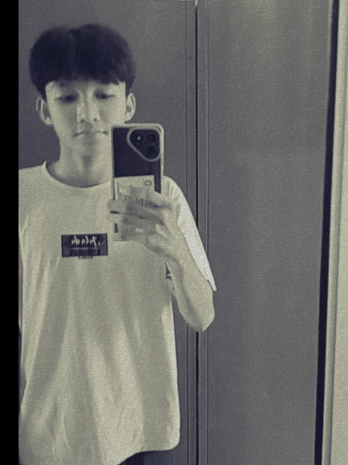

<div align="center">




<br/>

<a href="https://rizkyirawan.rcl.biz.id">
  
</a>

<br/><br/>

[](https://rizkyirawan.rcl.biz.id)
[](mailto:zkyeea@gmail.com)
[](#)

</div>

<br/>

## 👋 Tentang Saya

Saya **Rizky Irawan**, seorang pelajar dari Lampung Tengah, Indonesia yang antusias mendalami **web development**. Perjalanan coding saya dimulai pada **2023**, dan sejak **2025** saya fokus mendedikasikan diri di dunia pengembangan web — bukan sekadar menulis kode, tapi merancang pengalaman.

Saya percaya web yang baik adalah perpaduan antara **estetika visual**, **performa**, dan **interaksi yang terasa hidup**. Repo ini adalah portofolio pribadi saya — sekaligus tempat saya bereksperimen dengan animasi, arsitektur frontend modern, dan micro-interaction yang halus.

```txt
const rizky = {
  role: "Web Developer",
  based_in: "Lampung Tengah, Indonesia",
  codingSince: 2023,
  focus: ["Frontend Engineering", "UI/UX", "Automation"],
  currentlyLearning: ["Backend Architecture", "Database Design"],
  funFact: "Lebih suka animasi 60fps daripada tidur tepat waktu 😅",
};
```

<br/>

## ✨ Apa yang Bisa Saya Kerjakan

<table>
<tr>
<td width="50%" valign="top">

**🎨 Responsive Web Design**
Website yang tetap rapi & cepat di semua ukuran layar — dari HP kecil sampai monitor ultrawide, lengkap dengan micro-interaction.

**🤖 WhatsApp Bot Automation**
Mengubah alur manual jadi otomatis: auto-reply, notifikasi, hingga integrasi sistem lain lewat bot berbasis JavaScript.

**🔌 API Integration & Scraping**
Menyambungkan aplikasi ke sumber data eksternal — konsumsi REST API maupun scraping terstruktur.

</td>
<td width="50%" valign="top">

**🧩 UI/UX Prototyping**
Merancang alur & tampilan sebelum ditulis jadi kode, supaya keputusan desain teruji lebih dulu.

**🗄️ Database & Backend Setup**
Struktur data MySQL/PHP yang rapi di belakang layar, supaya fitur di depan jalan stabil.

**🔀 Version Control**
Mengelola histori kode dengan Git/GitHub yang bersih & terstruktur.

</td>
</tr>
</table>

<br/>

## 🖥️ Tentang Website Ini

Website ini adalah **single-page portfolio** yang dibangun dengan filosofi *"terasa hidup, tapi tetap ringan"* — setiap elemen yang bergerak punya alasan, bukan sekadar hiasan.

### Cara Kerja

- **Rendering** — dibangun di atas **Next.js App Router**, di-*compile* menjadi **static export** murni (HTML/CSS/JS), sehingga bisa di-*hosting* di mana saja tanpa server Node.js yang berjalan.
- **Reveal on scroll** — setiap section punya komponen `<Reveal>` generik yang memicu animasi *fade + slide* saat elemen masuk viewport, memakai **Intersection Observer** di balik layar (`useInView`), dan hanya berjalan sekali per elemen agar hemat kerja JS di halaman yang panjang.
- **Physics-based motion** — animasi angka (statistik), progress bar, dan hover effect digerakkan oleh **spring physics** (Framer Motion), bukan `ease` linear biasa, supaya gerakannya terasa natural.
- **Tema gelap/terang** — dikelola oleh `next-themes`, dengan skrip anti-*flicker* yang menyuntikkan tema yang benar sebelum React sempat *hydrate*.
- **Aksesibilitas** — menghormati `prefers-reduced-motion`, kontras warna terjaga di kedua tema, dan navigasi penuh via keyboard.
- **Formulir kontak** — mengirim pesan langsung dari browser tanpa backend sendiri, cocok untuk arsitektur static export.

### Struktur Halaman

| # | Section | Isi |
|---|---------|-----|
| 01 | **About** | Profil singkat & fokus keahlian |
| 02 | **Stats** | Angka & pencapaian (animated counter) |
| 03 | **Skills** | Tech stack — dikelompokkan Frontend → Backend → Database & Tools |
| 04 | **Journey** | Linimasa perjalanan belajar |
| 05 | **Projects** | Proyek-proyek yang pernah dikerjakan |
| 06 | **Services** | Layanan yang bisa saya bantu kerjakan |
| 07 | **Code Playground** | Editor JavaScript interaktif langsung di browser |
| 08 | **Workflow** | Alur kerja dari riset sampai deployment |
| 09 | **FAQ** | Pertanyaan yang sering ditanyakan |
| 10 | **Contact** | Formulir & kanal untuk menghubungi saya |

<br/>

## 🛠️ Tech Stack

<div align="center">


</div>

<br/>

<div align="center">

**Frontend**


**Backend & Bahasa Lain**


**Database & Tools**


</div>

<br/>

## 🎬 Sorotan Animasi & Interaksi

- Section **Technical Skills** menampilkan tech stack sebagai *capsule pills* dengan entrance animation berurutan (*staggered*) dan efek *glow* saat di-*hover*, warnanya menyesuaikan warna khas tiap teknologi.
- Counter statistik menghitung naik dengan *easing* kubik saat pertama kali terlihat di layar.
- Progress bar & angka digerakkan oleh satu *motion value* yang sama, supaya keduanya selalu sinkron sempurna.
- Semua animasi memakai `transform` & `opacity` (bukan properti yang memicu *layout reflow*), dioptimalkan untuk tetap mulus di 60–120 FPS.

<br/>

<div align="center">


**Terima kasih sudah mampir ✨**
Kalau ada proyek yang ingin didiskusikan, jangan ragu untuk [menghubungi saya](mailto:zkyeea@gmail.com).

</div>
